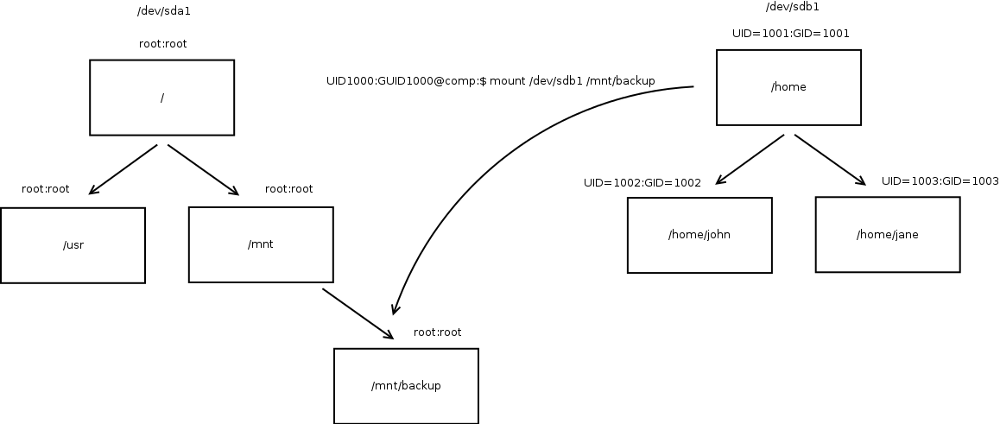
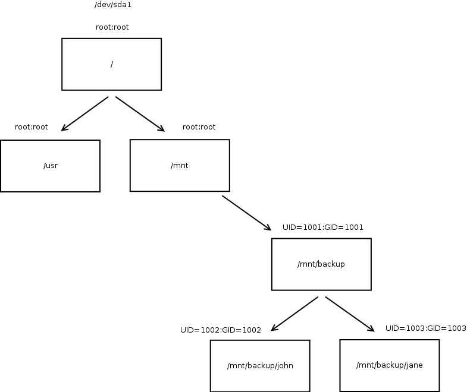

# The bind mounts

**bind是mount中比较特殊的用法之一，这里对一些例子进行分析和实验**

bind的意思是，把其他地方的子树再进行挂载，也就是说可以把文件系统中的某一个部分进行挂载。这个特性是从linux2.4.0开始的。

## 最基础的用法的如下

    mount --bind olddir newdir

如果执行了上面这个命令，在olddir和newdir都可以访问相同的内容，并且如果对其中一个目录内的内容进行了修改，在另一个目录会有相同的显示。

## 下面的命令可以创建一个挂载点

    mount --bind foo foo

在挂载后可以通过mount命令查看所有的挂载点
## 如果要递归的挂载一个目录可以使用如下命令

    mount --rbind olddir newdir

递归的挂载是指如果挂载的olddir内有挂载点，会把这个挂载点也一起挂载到newdir下。

## --bind可以支持一些选项

例如：挂载一个目录。并且让他是只读的：

    mount --bind olddir newdir
    mount -o remount,ro,bind olddir newdir

在使用 -o 的时候，是对一个已经挂载的

这样在新的目录中的内容是无法更改的，老的目录依然是可以修改的。

## mount图解：

参考：http://unix.stackexchange.com/questions/77020/what-happens-to-uids-upon-mount-of-file-system
